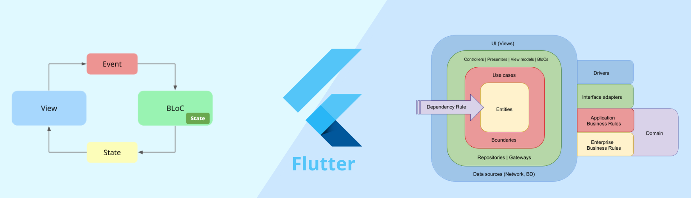
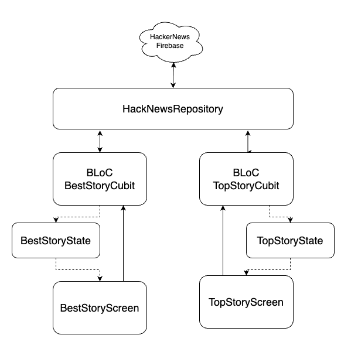

# native. Flutter mobile app

# Result

## Device Requirement

### Android

- Minimum Android Version: `Android 5.0 (Lollipop)`
- Default Web Browser app

### iOS

- Minimum iOS Version: `iOS 11.0`
- Default Web Browser app

## Quick result

### Install the app to the device/emulator

You can find the [apk](output/app-stg-release.apk) file and install to `Android` device or emulator with the following command. 

```
cd [this project]
$ adb install output/app-stg-release.apk
```
Note: for the detail of `adb` (Android Debug bridge), please refer [here](https://developer.android.com/tools/adb)

## Background

This project is a Flutter application created by the flutter commands,
```
flutter create native_as_you_are --platforms=android,ios --org=me.be-native.mobile
```

This project only support to build on `iOS` and `Android` for the development skill demonstration only.

## How to build

### Prerequisite tools

- [Flutter SDK](https://docs.flutter.dev/get-started/install)
- [Task](https://taskfile.dev/), you can install with following ways
```
# Using Homebrew
$ brew install go-task

# Using NPM
$ npm install -g @go-task/cli

# Using shell script
$ sh -c "$(curl --location https://taskfile.dev/install.sh)" -- -d
```
- [Xcode](https://developer.apple.com/xcode/)
- [Android SDK](https://developer.android.com/tools/releases/platform-tools) or install [Android Studio](https://developer.android.com/studio)

Note: once you installed Flutter SDK, you can use the following command to diagnose your development environment. 

```
$ flutter doctor

Doctor summary (to see all details, run flutter doctor -v):
[✓] Flutter (Channel stable, 3.7.0, on macOS 13.0 22A380 darwin-arm64, locale en-JP)
[✓] Android toolchain - develop for Android devices (Android SDK version 33.0.1)
[✓] Xcode - develop for iOS and macOS (Xcode 14.2)
[✓] Chrome - develop for the web
[✓] Android Studio (version 2022.1)
[✓] VS Code (version 1.76.0)
[✓] Connected device (4 available)
[✓] HTTP Host Availability
```

### Configurations

In this application, we have setup two build environments: 
- `prod`: Production environment, configuration file: `.env.prod`
- `stg`: Staging environemtn, configuration file: `.env.stg` 

Configurations
```
HK_BASE_URL=https://hacker-news.firebaseio.com/v0
HTTP_CLIENT_TIMEOUT=10000
LOG_LEVEL=INFO
```
- `HK_BASE_URL` is the base URL of HackerNews API
- `HTTP_CLIENT_TIMEOUT` is the timeout for Http client
- `LOG_LEVEL` is the output level for the logger. Levels: `ERROR`, `WARM`, `INFO`, `DEBUG`, `VERBOSE`

Note: in this project, since it is demonstration purpose, the `HK_BASE_URL` is the same in both environments. 

### Build the project

Build ths project is relatively easy by using `Task`

- Install dependencies and generating required files

```
$ task get
$ task generate
```

- Build app bundle

```
# Android
$ task build-apk -- stg

# iOS
$ task build-ipa -- stg
```

- Run app on device/emulator
  
```
$ task run -- stg
```

## Dependencies

- [flutter_bloc](https://pub.dev/packages/flutter_bloc): Flutter Widgets that make it easy to implement the BLoC (Business Logic Component) design pattern.
- [url_launcher](https://pub.dev/packages/url_launcher): Flutter plugin for launching a URL. Supports web, phone, SMS, and email schemes.
- [slang](https://pub.dev/packages/slang): Localization / Internationalization (i18n) solution.
- [logger](https://pub.dev/packages/logger): Small, easy to use and extensible logger which prints beautiful logs.
- [flutter_native_splash](https://pub.dev/packages/flutter_native_splash): Customize Flutter's default white native splash screen with background color and splash image.
- [get_it](https://pub.dev/packages/get_it): Simple direct Service Locator
- [auto_route](https://pub.dev/packages/auto_route): AutoRoute is a declarative routing solution.
- [dio](https://pub.dev/packages/dio): A powerful HTTP client for Dart/Flutter
- [flutter_dotenv](https://pub.dev/packages/flutter_dotenv): Easily configure any flutter application with global variables using a `.env` file.
- [freezed](https://pub.dev/packages/freezed): Code generator for data-classes/unions/pattern-matching/cloning
- [json_serializable](https://pub.dev/packages/json_serializable): Automatically generate code for converting to and from JSON by annotating Dart classes.
- [infinite_scroll_pagination](https://pub.dev/packages/infinite_scroll_pagination): Lazily load and display pages of items as the user scrolls down your screen.

## Architecture

BLoC Pattern with Clean Architecture




## Testing

For the testing, in this project currently only focus on testing `BLoC` components for the sake of checking the data correctness. 

Please check [test](test/) folder to see the test cases, or run:

```
$ task test
```

## Trouble shooting

### On Mac, facing `can't be opened because apple cannot check it for malicious software`

You have to allow to open on your mac, otherwise cause `Error (Xcode): Target debug_ios_bundle_flutter_assets failed: ShaderCompilerException` 

For [impellerc] as example
(located at: `/opt/homebrew/Caskroom/flutter/3.7.0/flutter/bin/cache/artifacts/engine/darwin-x64/impellerc` )

1. In the Finder on your Mac, locate the app you want to open. Don’t use Launchpad to locate the app.
2. Control-click the app icon, then choose Open from the shortcut menu.
3. Click Open.

The app is saved as an exception to your security settings, and you can open it at any time by double-clicking it, just as you do with any registered app.
Details in [here](https://support.apple.com/en-gb/guide/mac-help/mchleab3a043/mac)


### Cannot build for iOS: `No valid code signing certificates were found` 

You need to apply the Apple developer program as following message:
```
No valid code signing certificates were found
You can connect to your Apple Developer account by signing in with your Apple ID
in Xcode and create an iOS Development Certificate as well as a Provisioning 
Profile for your project by:
  1- Open the Flutter project's Xcode target with
       open ios/Runner.xcworkspace
  2- Select the 'Runner' project in the navigator then the 'Runner' target
     in the project settings
  3- Make sure a 'Development Team' is selected under Signing & Capabilities > Team. 
     You may need to:
         - Log in with your Apple ID in Xcode first
         - Ensure you have a valid unique Bundle ID
         - Register your device with your Apple Developer Account
         - Let Xcode automatically provision a profile for your app
  4- Build or run your project again
  5- Trust your newly created Development Certificate on your iOS device
     via Settings > General > Device Management > [your new certificate] > Trust

For more information, please visit:
  https://developer.apple.com/library/content/documentation/IDEs/Conceptual/
  AppDistributionGuide/MaintainingCertificates/MaintainingCertificates.html
```


## References

- [Lab: Write your first Flutter app](https://docs.flutter.dev/get-started/codelab)
- [Cookbook: Useful Flutter samples](https://docs.flutter.dev/cookbook)
- [Getting started Flutter](https://docs.flutter.dev/)
